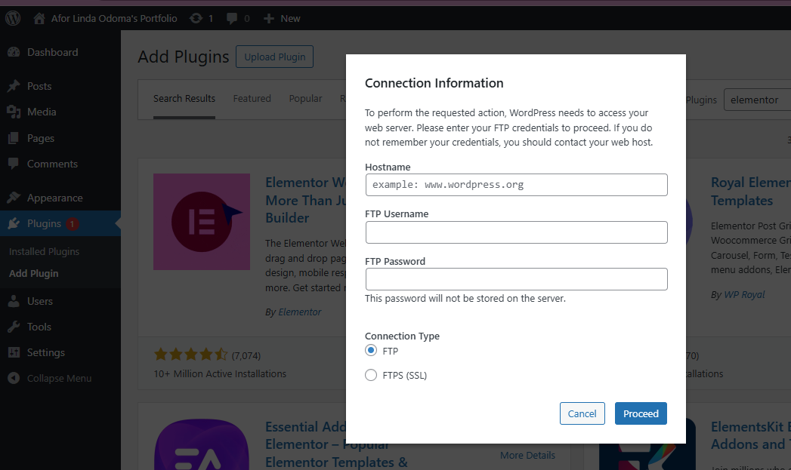

# Running-WordPress-on-AWSEC2

If you get this error while installing starter template login

You are running your Wordpress on AWS EC2. You wanted to install and activate a plugin. Then you get the error
Sorry, you are not allowed to access this page.

Or
Starter Templates: XMLReader extension is missing! To import templates, please get in touch with your hosting provider to enable this extension.
It means you do not have XMLReader extension installed. XMLReader is a PHP extension that allows efficient, stream-based parsing of XML files. Many WordPress themes or plugins (like Starter Templates) rely on it to import demo content.

You can solve this by Loging into cPanel..
I am not picking this option.
Connect to your EC2 instance via SSH. This is the exact location you did your installations like apache. For me I use Mobaxterm. If you want to install Mobaxterm chech this video start from
Its proper to check the version of php you are working with
php –v
Do you want to check if xmlreader Is Installed? Run
php -m | grep xmlreader

it should return xmlreader
If it returns nothing, the extension is missing, and you'll need to install it.

Since we're on Ubuntu, follow these steps:

1. Update package list
   sudo apt update
2. Install the XML extension for your version of php

sudo apt install php8.3-xml
cos I use php8.3

replace yours with your version

sudo apt install php<add version here>-xml

3. I am using Apache so
4. Restart Apace
   sudo systemctl restart apache2
5. Confirm It’s Installed
   Re-run:
   bash
   CopyEdit
   php -m | grep xmlreader
   You should now see:
   nginx
   CopyEdit
   xmlreader

## Dashboard> start customizing

…or create a new repository on the command line
echo "# Running-WordPress-on-AWSEC2" >> README.md
git init
git add README.md
git commit -m "first commit"
git branch -M main
git remote add origin https://github.com/AforOdoma/Running-WordPress-on-AWSEC2.git
git push -u origin main
…or push an existing repository from the command line
git remote add origin https://github.com/AforOdoma/Running-WordPress-on-AWSEC2.git
git branch -M main
git push -u origin main

#

using the whoami test method you mentioned.

This will eliminate the FTP prompt by giving WordPress the correct file ownership.

✅ Step 1: Find Out What User Apache is Running As
SSH into your server, then go to your WordPress directory:

bash
Copy
Edit
cd /var/www/html/wordpress
Create a PHP test file to find the Apache user:

bash
Copy
Edit
sudo nano whoami.php
Paste this code into the file:

php
Copy
Edit

<?php echo(exec("whoami")); ?>

Save and exit (Ctrl + O, Enter, then Ctrl + X).

Visit this file in your browser:

arduino
Copy
Edit
http://yourdomain.com/whoami.php
You’ll see output like:

kotlin
Copy
Edit
www-data
or

nginx
Copy
Edit
apache
or

nginx
Copy
Edit
daemon
✅ Step 2: Change File Ownership to the Apache User
Let’s say the result from the previous step was daemon. You’d now run:

bash
Copy
Edit
sudo chown -R daemon:daemon /var/www/html/wordpress
If the result was www-data (most common for Ubuntu with Apache), then run:

bash
Copy
Edit
sudo chown -R www-data:www-data /var/www/html/wordpress
✅ Step 3: Set Correct File & Folder Permissions
This ensures WordPress can safely read and write files:

bash
Copy
Edit
sudo find /var/www/html/wordpress -type d -exec chmod 755 {} \;
sudo find /var/www/html/wordpress -type f -exec chmod 644 {} \;
✅ Step 4: Remove the Test File
Once you're done, delete the whoami.php file to prevent security risks:

bash
Copy
Edit
sudo rm /var/www/html/wordpress/whoami.php
✅ Step 5: (Optional but Recommended) Add Direct FS Method
Edit your wp-config.php:

bash
Copy
Edit
sudo nano /var/www/html/wordpress/wp-config.php
Add the following line before /_ That's all, stop editing! Happy publishing. _/:

php
Copy
Edit
define('FS_METHOD', 'direct');
Save and exit.

✅ Step 6: Try Again in WordPress
Go to your WordPress dashboard, and try to install a plugin or theme. The FTP prompt should be gone now.
